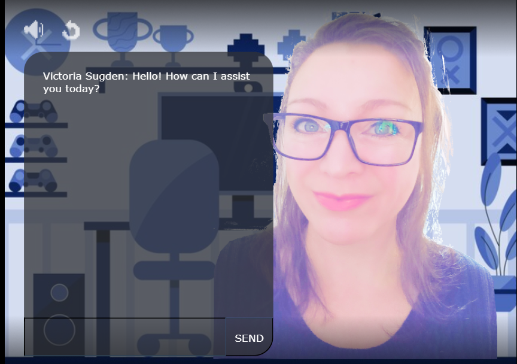

# Chat Bot

## Overview

Interactive chat where you can chat with me!

## Technology Stack

- **Rosebud AI**: Used for generating assets and enhancing the creative process.
- **Phaser**: A powerful framework for developing 2D games, used to build and run the game.

## Live on RosebudAI

[Play on RosebudAI](https://play.rosebud.ai/games/9d7b20e5-87ca-4127-8626-59c3fbec6561)

## Usage

The following image show the game's appearance and functionality:

## License

This project is licensed under the MIT License. See the [LICENSE](LICENSE) file for more details.

## Acknowledgements

- Special thanks to the Rosebud AI team for their support and resources.
- Also thanks to Freepix for the use of the background image. 
